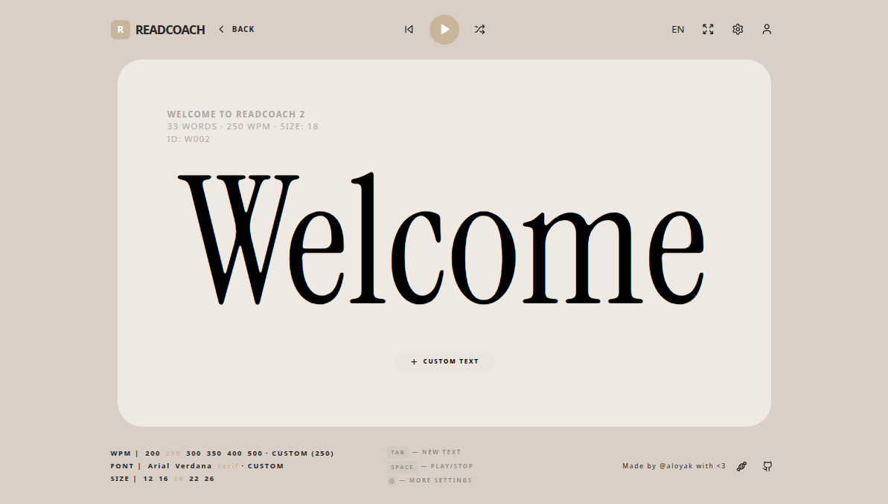

# ReadCoach
ReadCoach is a training website that uses RSVP (Rapid serial visual presentation) in order to improve very quickly reading speed

Made for HackClub's Flavourtown event: https://flavortown.hackclub.com/projects/7483

Live web: https://read-coach.vercel.app/

### Running
port 5173 for frontend and 8000 for backend (not in use right now), the docker file has everything setup

```sh
sudo docker-compose up --build
```

### Preview

